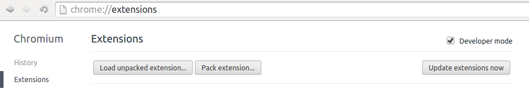

ganalytics-lastDay
==================

a Google Chrome/Chromium extension to automatically set today's date in google analytics' range

What it does
------------

When you open Google Analytics you're greeted with a summary of all visits to your website(s) in the last month, the current day excluded.

This extension is a launcher for the Google Analytics page that automatically sets the time range so that you're greeted with all visits to your website(s) that occurred between yesterday and today (both included).

See [my blog post](http://somethingididnotknow.wordpress.com/2013/06/27/change-default-date-range-in-google-analytics-with-a-chrome-extension) for more details.

Setup
-----

* Open the chrome://extensions page in Chrome/Chromium
* Drag and drop [the .crx extension](ganalytics-lastDay.crx) (you can also download that file without cloning the whole repo: just get it [here](https://github.com/micheleb/ganalytics-lastDay/blob/master/ganalytics-lastDay.crx?raw=true))
* Confirm adding the extension
* Open the extension: you can find it by clicking on Chrome's "Apps" link in the bookmarks bar, or by navigating to chrome://apps

Changing the extension
----------------------

Edit the code however you like; if you need more info on what needs to be changed, see [my blog post](http://somethingididnotknow.wordpress.com/2013/06/27/change-default-date-range-in-google-analytics-with-a-chrome-extension) for more details.

To repackage the extension:
* Open the chrome://extensions page in Chrome/Chromium
* make sure that Developer Mode is checked in the top part of the page 
* click on "Pack extension", and choose the ganalytics-lastDay folder (not the project top level folder, the one inside of it)
* after the .crx file is created, you can drag and drop it onto the chrome://extensions page
* anytime you make further changes to the extension you may want to simply hit the Reload button for the extension

